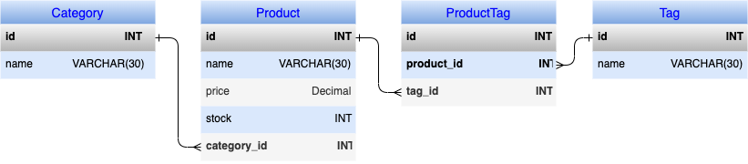
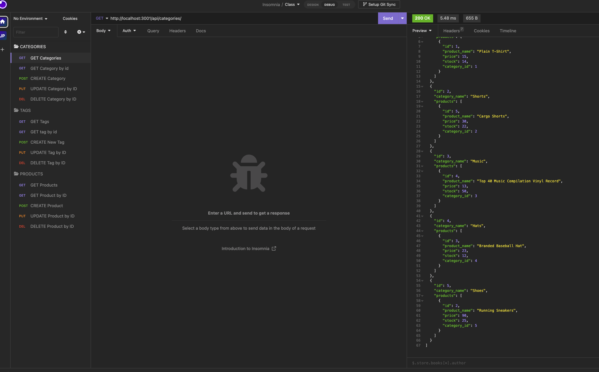

# E_Commerce_Backend

 

## Description

This project is a backend E_Commerce app, it uses MYSQL as the database and Insomnia to run the GET, POST, PUT, and DELETE request. These request are used for Categories, Tags, and Products to add to the database and be able to form associations to help an E_Commerce site stay organized. The most challenging and difficult area's for me way creating the products POST and PUT request, and although I still have ALOT more to learn pertaining to this project, I did overcome some challenges and learnt a lot from this project, but I feel this is one of those areas that needs to be studied and practice with time. This project does use sequelize, mysql2, dotenv, express as npm packages, so all that is implemented into this project.

## Table of Contents

- [Link](#link)
- [ScreenShot](#screenshot)
- [Installation](#installation)
- [Usage](#usage)
- [Credits](#credits)
- [License](#license)
- [Badges](#badges)
- [API](#api)

## Link

Below is a link to a walk through video demonstrating the app in use: 
[E_Commerce_Backend](https://drive.google.com/file/d/1fi8mCVk09SgNTeRjO37YLzJtCNW6_J_J/view) 
[Projects_Repo](https://github.com/garciajv86/E_Commerce_BackEnd)

## ScreenShot
DataBase Design:
 

 

Insomnia:
 

## Installation

This app requires the MySQL database and Insomnia to be installed on your computer, I provided links below. 
[MySQL_Download](https://dev.mysql.com/downloads/mysql/)
 
[Insomnia_Download](https://docs.insomnia.rest/)

## Usage

To use this app you must first log into your MySQL database and run the schema.sql file located in the db folder. Once you have ran the schema you can than quit MySQL. Now you must run the command npm run seed to seed your database. Once the database is seeded you then can run the command npm start to allow you the server to start listening. Once the server is listening you can open the insomnia app and start making request, a demo of how to do so is in the link above under Link titled E_Commerce_Backend.

## Credits

- Joshua V. Garcia

- [My GitHub Profile](https://github.com/garciajv86)

## License

 
This project is protected under the [MIT](https://choosealicense.com/licenses/mit/) License.

## Badges

 

 

 

## API

MySQL2, express, sequelize, and dotenv was the NPM packages used for this project

- [MySQL Docs](https://www.npmjs.com/package/mysql2#installation)
- [Sequelize Docs](https://sequelize.org/docs/v6/)
- [Express Docs](https://expressjs.com/en/4x/api.html)
- [Dotenv Docs](https://www.npmjs.com/package/dotenv)
